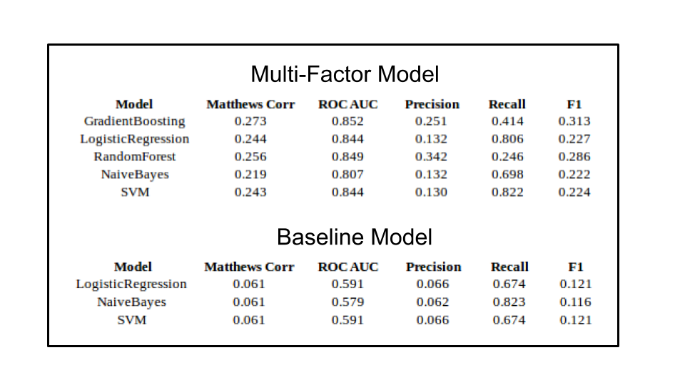
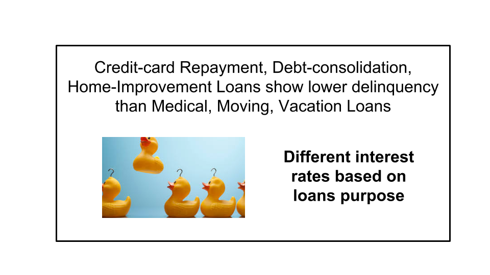
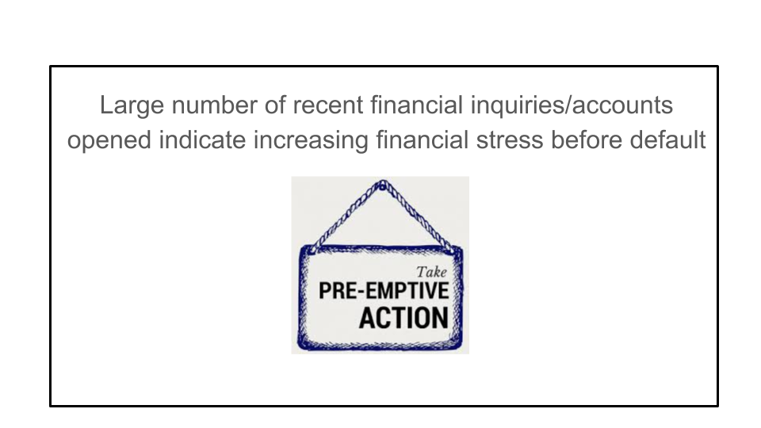

# ResponsibleLending
## Predicting Borrower Default Risk

### Summary
Every lender needs to assess a borrower's default risk and continue monitoring it during the life-time of the loan. Lenders include not only traditional banks and non-bank institutions for financial loans, but increasingly luxury goods rental companies who want to lend valuable products to people with less than excellent credit.

I have used Lending Club's loan-performance data set to study and predict borrower default risk. I engineer innovative features, build and compare models across a number of Machine-Learning methods including Logistic Regression, Gradient Boosted Trees, Random Forests and Support Vector Machines. I have discovered interesting insights about borrower default behavior which can be used by lenders to introduce new products and default reduction measures, and by borrowers to improve their creditworthiness.

### Data
[Lending Club](https://www.lendingclub.com/) has been facilitating peer-to-peer lending by bringing together lenders and borrowers since 2007. They maintain and share [loan performance data](https://www.lendingclub.com/info/download-data.action) for all loans issued. The data includes loan data, non-personal borrower and credit report information. Every quarter, loan repayment and status are updated, along with the borrower's credit score information. This provides a rich data set to study and predict borrower default risk.

### Model Choice 
The Fair Credit Equality Act makes it illegal for financial lenders to discriminate against borrowers based on a number of factors including age, gender, race, location. Regulators examine lenders' credit approval models to ensure compliance with the law. Moreover, when declining a person's credit application, lenders need to provide an explicit reason for their decision. 

This rules out models that lack clear interpretability. So I have built and compared performance of models using a number of different Machine-Learning methods including Logistic Regression, Naive Bayes, Gradient Boosted Trees, Random Forests and Support Vector Machines. This allows me to investigate the prediction accuracy between these methods that have decreasing interpretability and bias.

### Feature Engineering
I have used data from over 725,000 loans issued from Jan-2016 to Sep-2017. Each loan has 149 columns of data about the loan, non-personal borrower and credit report information. Loan data includes information like the loan amount, issue month, purpose, interest rate, repayment term and installment. Borrower data includes information about the borrower's income, employment, home ownership status and geographic location (3-digit zipcode and state). Credit report information includes the debt balances, limits and utilization across the different types of credit instruments (mortgage, personal installment loans, credit lines and bank cards), along with the FICO score at the time of loan origination. I studied the correlation of this data with borrower default, and then selected some of the strong predictors. I also engineered innovative new features by combining different data components to identify red flags in the loans.

### Model Trade-off and Optimization
Since the borrower default rate seen in the data is about 5%, I used the SMOTE package in Python to balance the *Current* and *Default* classes by oversampling the *Default* class data. This helps the model improve its *Recall* metric by reducing the number of false negatives.

In optimizing the model performance, there is a trade-off between the *Precision* and *Recall* metrics. In this context, a *High-Recall Low-Precision* percentage means that fewer borrowers will be approved for loans and will result in lost revenue for the lender. However, in the alternate *High-Precision Low-Recall* scenario, we will have a higher approval rate for borrowers but significantly more losses due to unexpected defaults. A lender would prefer to have the *High-Recall Low-Precision* scenario as a more predictable default rate will give him greater certainly in cash-flows and also allow him to offer the borrower a better interest rate after accounting for default losses.

### Model Performance
I have used a single factor (FICO score only) model as the baseline to compare model performance against the multi-factor models. This may seem simplistic but are used by luxury goods rental companies who lack the resources to build and maintain a larger predictive model.

After the models were fit on the class-balanced training dataset, the performance on the test dataset was evaluated along a number of metrics including Precision, Recall, F1 Score, Matthews Correlation Coefficient, and the ROC Area Under the Curve. The results are shown in the tables and graphs below.

The multi-factor model performs significantly better than the single-factor model along all methods, with the F1 score in the 22-32% range versus 10-12% range. The Matthews Correlation Coefficient is also around 25% for the multi-factor models versus about 6% for the single-factor models.

The multi-factor model results show that the Logistic Regression has the best performance in terms of *Recall* but its *Precision* is lower than the Gradient Boosted Trees and Random Forests classifiers. The F1 score and Matthews Correlation Coefficient measure overall performance balancing out the Precision and Recall, and are better for the Gradient Boosted Trees and Random Forests classifiers than the Logistic Regression.

I then studied the multi-factor Logistic Regression model to derive some interesting insights into borrower default behavior. These can be used by lenders to introduce new products and establish default reduction measures for borrowers. The model also provides advice for borrowers to improve their creditworthiness through simple measures.  

### Insights for Lenders

### Advice for Borrowers

#### Short credit history show higher delinquency -- Keep oldest credit card account open (preferably no annual-fee)

#### Large existing debt obligations deter lenders -- Reduce debt before applying for more
