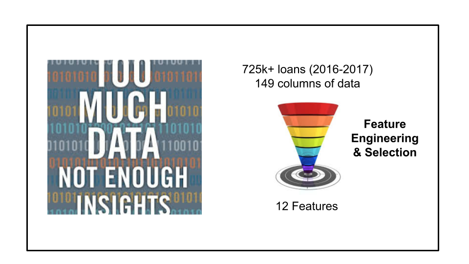

# ResponsibleLending
## Predicting Borrower Default Risk

### Summary
Every lender needs to assess a borrower's default risk and continue monitoring it during the life-time of the loan. Lenders include not only traditional banks and non-bank institutions for financial loans, but increasingly luxury goods rental companies who want to lend valuable products to people with less than excellent credit.

I have used Lending Club's loan-performance data set to study and predict borrower default risk. I engineer innovative features, build and compare models across a number of Machine-Learning methods including Logistic Regression, Gradient Boosted Trees, Random Forests and Support Vector Machines. I have discovered interesting insights about borrower default behavior which can be used by lenders to introduce new products and default reduction measures, and by borrowers to improve their creditworthiness.

### Data
[Lending Club](https://www.lendingclub.com/) has been facilitating peer-to-peer lending by bringing together lenders and borrowers since 2007. They maintain and share [loan performance data](https://www.lendingclub.com/info/download-data.action) for all loans issued. The data includes loan data, non-personal borrower and credit report information. Every quarter, loan repayment and status are updated, along with the borrower's credit score information. This provides a rich data set to study and predict borrower default risk.

### Model 
The Fair Credit Equality Act makes it illegal for financial lenders to discriminate against borrowers based on a number of factors including age, gender, race, location. Regulators examine lenders' credit approval models to ensure compliance with the law. Moreover, when declining a person's credit application, lenders need to provide an explicit reason for their decision. 

This rules out models that lack clear interpretability. So I have built and compared performance of models using a number of different Machine-Learning methods including Logistic Regression, Naive Bayes, Gradient Boosted Trees, Random Forests and Support Vector Machines. This allows me to investigate the prediction accuracy between these methods that have decreasing interpretability and bias.

I have used data from over 725,000 loans issued from Jan-2016 to Sep-2017. Each loan has 149 columns of data about the loan, non-personal borrower and credit report information. Loan data includes information like the loan amount, issue month, purpose, interest rate, repayment term and installment. Borrower data includes information about the borrower's income, employment, home ownership status and geographic location (3-digit zipcode and state). Credit report information includes the debt balances, limits and utilization across the different types of credit instruments (mortgage, personal installment loans, credit lines and bank cards), along with the FICO score at the time of loan origination. I studied the correlation of this data with borrower default, and then selected some of the strong predictors. I also engineered innovative new features by combining different data components to identify red flags in the loans.

Class balancing since default rate is under 4%

Trade-off between precision and recall 

Graphs/Tables by model

Commentary on model performance

### Insights for Lenders

Borrowers default early into a loan rather than later -- Sliding interest rate product

Credit Card Repayment, Debt Consolidation and Home Improvement loans have lower delinquency than Medical, Moving and Vacation loans -- Differential interest rate based on loan purpose

Large number of financial inquiries and accounts open indicate increasing financial stress on borrower -- Pre-emptive action by lenders to follow up with borrows to prevent default (possibly by restructuring or changing terms)

### Advice for Borrowers

Long employment length indicates stability in income -- Avoid changing employer just before applying for new credit especially mortgage

Late payments have a big impact on credit -- Alerts/Autopay to avoid careless late payments

Short credit history show higher delinquency -- Keep oldest credit card account open (preferably no annual-fee)

Large existing debt obligations deter lenders -- Reduce debt before applying for more
